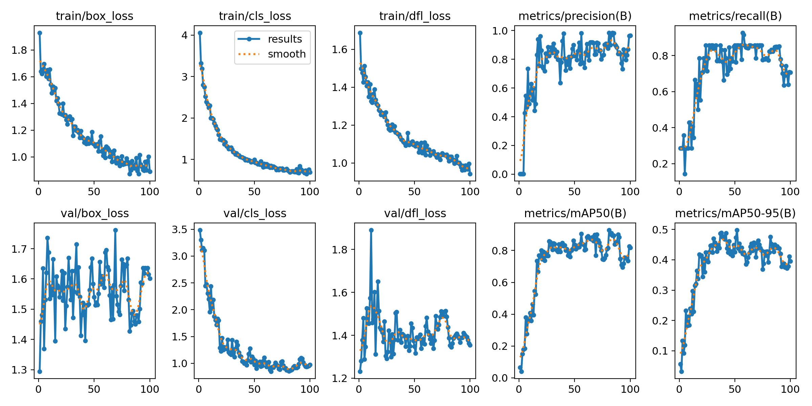

# Drone Build YOLO V8

Training and validation with yolov8 with the [builddetect](https://universe.roboflow.com/arturwork/builddetect/dataset/5) dataset (segmented labeling) where training is carried out normally and transfer learning

It is concluded that training with transfer learning, specifically with "coco", gives better performance.

----
# Segmentation
## Normal way

Validation

  

ConfusionMatrix Training

  

Results YOLO V8  Training

  

----

## Transfer Learning  way

Validation

  

ConfusionMatrix Training

  

Results YOLO V8  Training

  

----
# Detection
## Normal way

Validation

  

ConfusionMatrix Training

  

Results YOLO V8  Training

  

----

## Transfer Learning  way

Validation

  

ConfusionMatrix Training

  

Results YOLO V8  Training

  

